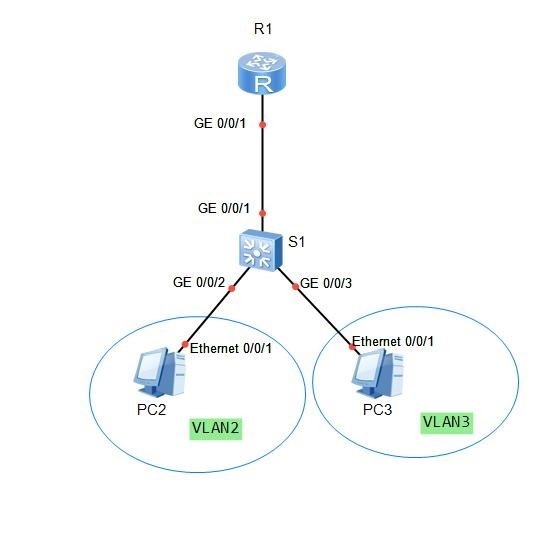
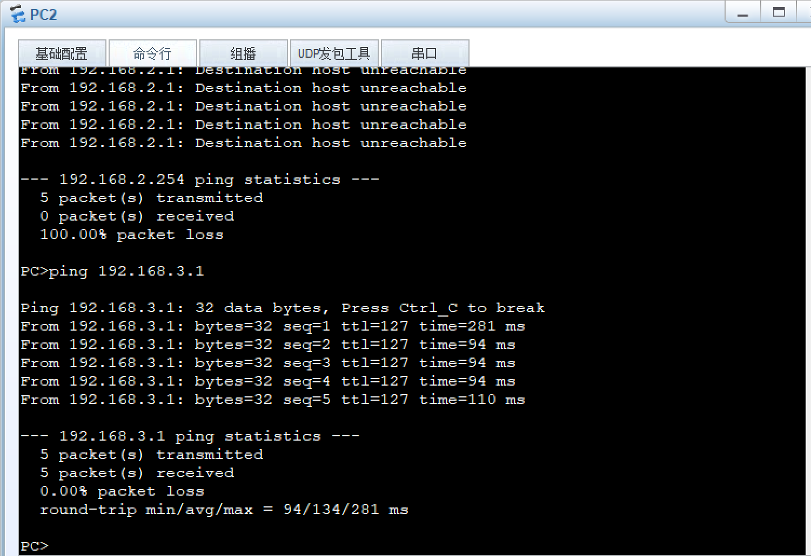
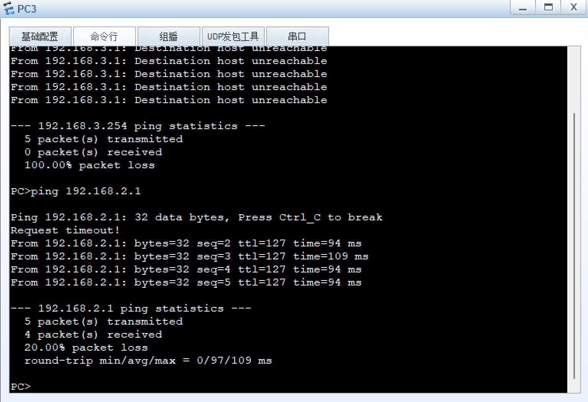
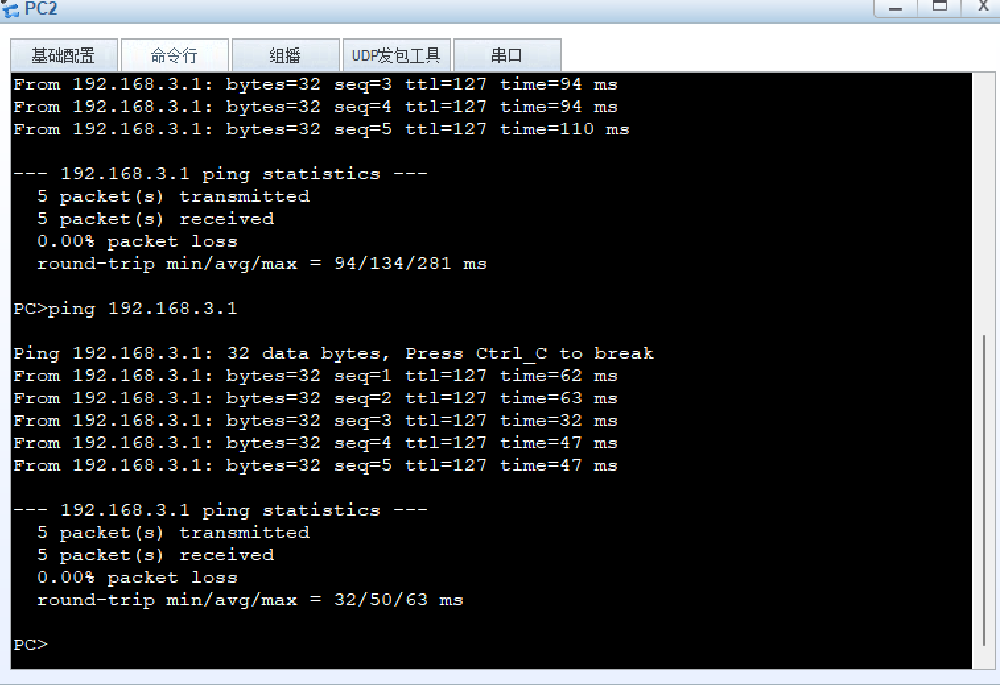
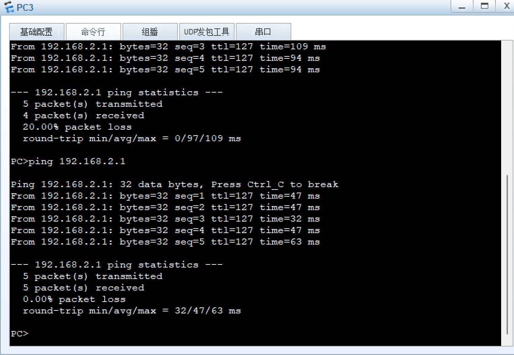

# 实验 5：实现VLAN 间通信实验
#### 关于本实验  
划分 VLAN 后，不同 VLAN 的用户间不能二层互访，这样能起到隔离广播的作用。但实际应用中，不同 VLAN 的用户又常有互访的需求，此时就需要实现不同VLAN的用户互访，简称 VLAN 间互访。
华为提供了多种技术实现 VLAN 间互访，常用的两种技术为VLANIF 接口和Dot1q终结子接口。  
* Dot1q终结子接口：子接口也是一种三层的逻辑接口。跟VLANIF接口一样，在子接口上配置Dot1q终结功能和IP地址后，设备也会添加相应的MAC表项并置位三层转发标志位，进而实现VLAN间的三层互通。Dot1q终结子接口适用于通过一个三层以太网接口下接多个VLAN网络的环境。
* VLANIF 接口：VLANIF 接口是一种三层的逻辑接口。在VLANIF 接口上配置IP地址后，设备会在 MAC 地址表中添加 VLANIF 接口的MAC 地址+VID 表项，并且为表项的三层转发标志位置位。当报文的目的 MAC 地址匹配该表项后，会进行三层转发，进而实现 VLAN 间的三层互通。  
本实验将通过这两种方式来实现 VLAN 间互访需求，帮助学员进一步理解跨VLAN互访的原理。  
#### 实验目的
* 掌握通过配置 Dot1q 终结子接口方法实现 VLAN 间互访
* 掌握通过配置 VLANIF 接口方法实现 VLAN 间互访
* 深入理解 VLAN 间互相访问的转发流程
#### 实验组网介绍

1. 1.PC2和PC3为终端用户，接口IP地址分别为 192.168.2.1/24和192.168.3.1/24。  
2. 2.PC2和PC3的网关地址分别为192.168.2.254和192.168.3.254。  
3. 在S1上将GigabitEthernet0/0/2和GigabitEthernet0/0/3分别划入VLAN2和VLAN3。  
#### 实验背景
PC2 和 PC3 处于不同的 VLAN，现要求通过 VLANIF 接口和Dot1q 终结子接口分别实现 PC2 和 PC3 之间的互访需求。  
#### 实验任务配置
1. 配置 Dot1q 终结子接口方法实现 VLAN 间互访
2. 配置 VLANIF 接口方法实现 VLAN 间互访
#### 配置步骤步骤
1. **设备基础配置**  
**给 R1 和 S1 命名**  
[R1]`sys R1`  
[S1]`sys S1`  
**在S1上对PC2和PC3进行VLAN划分**  
[S1]`vlan batch 2 3`  
[S1-GigabitEthernet0/0/2]`port link-type access`  
[S1-GigabitEthernet0/0/2]`port default vlan 2`  
[S1-GigabitEthernet0/0/3]`port link-type access`  
[S1-GigabitEthernet0/0/3]`port default vlan 3`  
2. **通过 Dot1q 终结子接口实现 VLAN 间互访**  
**配置 S1 上的 Trunk 接口**  
[S1-GigabitEthernet0/0/1]`port trunk allow-pass vlan 2 3`  
**在R1上创建并配置 Dot1q 终结子接口**  
网络组网图中PC2的ip地址为192.168.2.1 网关为192.168.2.254  
网络组网图中PC2的ip地址为192.168.2.1 网关为192.168.3.254   
[R1-GigabitEthernet0/0/1.10]`dot1q termination vid 2`  
[R1-GigabitEthernet0/0/1.10]`ip add 192.168.2.254 24`  
[R1-GigabitEthernet0/0/1.10]`arp broadcast enable`  
[R1-GigabitEthernet0/0/1.10]`dot1q termination vid 3`  
[R1-GigabitEthernet0/0/1.10]`ip add 192.168.3.254 24`  
[R1-GigabitEthernet0/0/1.10]`arp broadcast enable`  
**检测 VLAN 间互访联通性**  
  
 
3. **通过VLANIF接口实现VLAN间互访**
**清除上一步配置**  
略  
**在S1上创建相应的VLANIF接口**  
[S1]`int Vlanif2`  
[S1-Vlanif2]`ip address 192.168.2.254 24`  
[S1-Vlanif2]`q`  
[S1]`int Vlanif3`  
[S1-Vlanif3]`ip address 192.168.3.254 24`  
[S1-Vlanif3]`q`  
**检测 VLAN 间互访联通性**  
  
 

