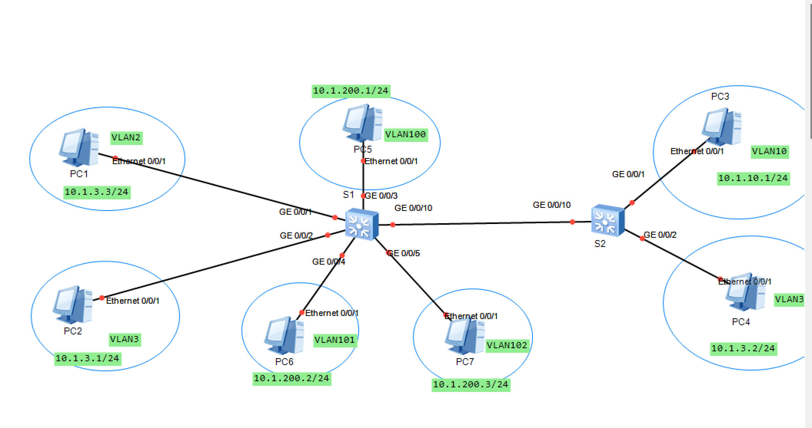

# 实验4：以太网基础与VLAN配置实验
**实验背景:**  
某公司根据业务需求，需要对其二层网络进行VLAN划分。同时，VLAN 10为特殊VLAN，为了保证信息安全，只有某些特殊的PC才可以通过VLAN 10进行网络访问。
如实验拓扑图所示，可以在S1和S2交换机上配置基于接口划分VLAN，把业务相同的用户连接的接口划分到同一VLAN。同时，可以在S2上配置基于MAC地址划分VLAN，绑定特殊PC的MAC地址。在S1上配置Hybrid类型接口，实现VLAN100、VLAN101和VLAN102之间互访。

---
**配置思路:**
1. 创建VLAN
2. 配置交换机基于接口划分VLAN
3. 配置交换机基于MAC地址划分VLAN
4  配置交换机Hybrid类型接口，实现VLAN100、VLAN101和VLAN102之间互访.

**网络连接图**

---
**配置步骤:**
1. 设备命名  
S1:`sys S1`  
S2:`sys S2`

2. 配置设备IP地址
实验中PC1-PC7的IP地址已经配置好，无需学生配置。

3. 创建VLAN
在交换机S1上创建VLAN 2、3、10、100、101、102  
`vlan batch 2 to 3 10 100 to 102`  
在交换机S2上创建VLAN 2、3、10  
`vlan batch 2 to 3 10`

4. 配置基于接口划分VLAN  
配置交换机S1连接PC1、PC2的接口为Access接口，并将接口划入对应的
VLAN  
[S1-GigabitEthernet0/0/1]`port link-type access`  
[S1-GigabitEthernet0/0/1]`port default vlan 2`  
[S1-GigabitEthernet0/0/2]`port link-type access`  
[S1-GigabitEthernet0/0/2]`port default vlan 3`  
配置交换机S2连接终端PC4的接口为Access接口，并将接口划入对应的VLAN  
[S2-GigabitEthernet0/0/2]`port link-type access`  
[S2-GigabitEthernet0/0/2]`port default vlan 3`  
配置交换机S1和S2的互联接口为Trunk接口，并仅允许VLAN 2、3通过  
[S1-GigabitEthernet0/0/10]`port link-type trunk`  
[S1-GigabitEthernet0/0/10]`port trunk allow-pass vlan 2 3`  
[S1-GigabitEthernet0/0/10]`undo port trunk allow-pass vlan 1`  
[S2-GigabitEthernet0/0/10]`port link-type trunk`  
[S2-GigabitEthernet0/0/10]`port trunk allow-pass vlan 2 3`  
[S2-GigabitEthernet0/0/10]`undo port trunk allow-pass vlan 1`  

5. 配置基于MAC地址划分VLAN
如实验组网图所示，PC3的MAC地址为：a008-6fe1-0c46。希望该PC可以通过S2的GigabitEthernet0/0/1端口接入网络，并且通过VLAN 10进行数据传递.  
配置交换机S2，让PC3的MAC地址与VLAN 10关联  
[S2-vlan10]`mac-vlan mac-address a008-6fe1-0c46 priority 0`  
配置交换机S2的GigabitEthernet0/0/1接口为Hybrid接口，并允许基于MAC地址划分的VLAN通过当前Hybrid接口  
[S2-GigabitEthernet0/0/1]`port link-type hybrid`
[S2-GigabitEthernet0/0/1]`port hybrid untagged vlan 10`
配置交换机S1和S2的互联接口为Trunk接口，且允许VLAN 10通过  
[S1-GigabitEthernet0/0/10]`port link-type trunk`  
[S1-GigabitEthernet0/0/10]`port trunk allow-pass vlan 10`  
[S2-GigabitEthernet0/0/10]`port link-type trunk`  
[S2-GigabitEthernet0/0/10]`port trunk allow-pass vlan 10`  
配置交换机S2，使能GE0/0/1接口基于MAC地址划分VLAN功能。若想使通过接口的报文按照基于MAC地址划分的VLAN转发，必须使用使能接口的MAC VLAN功能。  
[S2-GigabitEthernet0/0/1]`mac-vlan enable`  

6. 查看配置信息  
略

7. 在交换机S1上配置基于接口划分VLAN，并配置Hybrid接口，实现VLAN100、VLAN101和VLAN102之间互访  
[S1-GigabitEthernet0/0/3]`port link-type hybrid`  
[S1-GigabitEthernet0/0/3]`port hybrid pvid vlan 100`  
[S1-GigabitEthernet0/0/3]`port hybrid untagged vlan 100 to 102`  
[S1-GigabitEthernet0/0/4]`port link-type hybrid`  
[S1-GigabitEthernet0/0/4]`port hybrid pvid vlan 101`  
[S1-GigabitEthernet0/0/4]`port hybrid untagged vlan 100 to 102` 
[S1-GigabitEthernet0/0/5]`port link-type hybrid`  
[S1-GigabitEthernet0/0/5]`port hybrid pvid vlan 102`  
[S1-GigabitEthernet0/0/5]`port hybrid untagged vlan 100 to 102`

